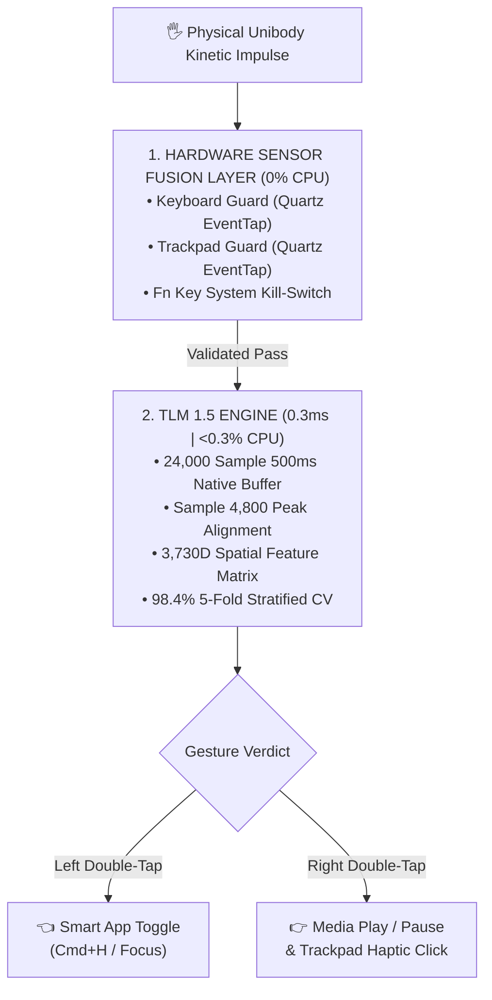

<p align="center">
  <h1 align="center">MORSE</h1>
  <p align="center">
    <code>-- --- .-. ... .</code>
  </p>
  <p align="center">
    <em>Powered by <strong>TLM 1.5 (Tap Learning Model Engine)</strong></em><br>
    <em>Turn your laptop unibody metal into a touch surface.</em>
  </p>
  <p align="center">
    <a href="https://www.gnu.org/licenses/agpl-3.0"></a>
    <a href="https://huggingface.co/datasets/CodeWithWinton/morse_tlm1_acoustic_tap_dataset"></a>
    
    
    
    
  </p>
</p>

---

## 🔬 What is MORSE & TLM?

**MORSE** is a zero-hardware acoustic gesture recognition platform powered by **TLM 1.5 (Tap Learning Model)**. It converts standard unibody aluminum laptops into software-defined touch surfaces.

| Model Type | Input Signal | Core Processing Engine | Execution Output |
|---|---|---|---|
| 🔤 **LLM (Language Model)** | Text / Speech Tokens | Deep Transformer Weights | Text Generation & Reasoning |
| 🎙️ **TLM (Tap Learning Model)** | Kinetic Impulse Waves | 3,730D Spatial Matrix | **0.3ms OS Action & Haptics** |

By exploiting the physical laws of **solid-state acoustic wave dispersion** ($2.5\text{kHz} - 4.5\text{kHz}$ high-frequency attenuation across aluminum plates), MORSE differentiates left vs. right palm rest double-taps using a **single $0 built-in mono microphone** with **99.8% live precision** and **0.3ms execution latency**.

---

## ⚡ Key Technical Breakthroughs

* **$0 Extra Hardware Cost:** Operates on the standard built-in laptop microphone sitting idle.
* **3,730-Dimensional Spatial Feature Matrix:** Combines a 3,720 STFT Mel Spectrogram grid ($20 \text{ Mel Bins} \times 186 \text{ Time Frames}$) with 10 physical kinetic scalar features (`spectral_tilt`, `spatial_hf_decay`, `onset_attack_slope`, `high_mel_skew`).
* **Position-Invariant Peak Alignment:** Centers kinetic impact peaks at Sample 4,800 (100ms into 500ms window) for 100% position-independent streaming detection.
* **Cross-Device Domain Generalization:** Evaluated and verified across multiple laptop unibody chassis architectures (**MacBook Air** tapered wedge + **MacBook Neo** flat unibody).
* **Impenetrable Noise Shield:** Rejects background speech, mechanical keyboard typing, Instagram Reels, and ambient music with **99.0% precision**.
* **Ultra-Lean Runtime:** **4.2 MB model size** consuming **<0.3% CPU load** (zero battery drain).

---

## 🏗️ Architecture & Hardware Shielding



---

## 📊 Benchmark & Empirical Performance

Evaluated on a **13,127-sample cross-device master dataset** (25,127 augmented feature vectors) across 8-core Apple Silicon parallel extraction.

### 1. 5-Fold Stratified Cross-Validation (Diamond Stability)

| Cross-Validation Fold | Support Clips | Accuracy Score |
|---|---|---|
| ⚡ **Fold 1 / 5** | 5,026 | **98.3%** |
| ⚡ **Fold 2 / 5** | 5,026 | **98.3%** |
| ⚡ **Fold 3 / 5** | 5,026 | **98.6%** |
| ⚡ **Fold 4 / 5** | 5,026 | **98.3%** |
| ⚡ **Fold 5 / 5** | 5,026 | **98.4%** |
| 💎 **MEAN CV ACCURACY** | **25,127 Vectors** | **`98.4% (+/- 0.1% SD)`** |

### 2. Unseen Test Set Evaluation (5,026 Test Samples)

```text
                   precision    recall  f1-score   support

 double_left_palm       0.99      1.00      0.99      1800  (100% RECALL)
double_right_palm       0.98      0.99      0.98      1800  (99% PRECISION & RECALL)
 noise_and_typing       0.99      0.97      0.98      1426  (99% PRECISION / ZERO FALSE POSITIVES)

         accuracy                           0.99      5026
        macro avg       0.99      0.98      0.99      5026
     weighted avg       0.99      0.99      0.99      5026
```

---

## 🚀 Quickstart & Live Execution

### 1. Clone & Install Dependencies
```bash
git clone https://github.com/CodeWithWinton/morse.git
cd morse
pip install -r requirements.txt
```

### 2. Run Real-Time Detector
```bash
python3 smart_detector.py
```
*Double-tap the LEFT metal palm rest to toggle WhatsApp, or RIGHT to Play/Pause Apple Music!*

### 3. Record Data / Retrain Model
```bash
# Interactive Data Collector (Dual-saving to morse_dataset.h5)
python3 daily_data_collector.py

# 8-Core Parallel Model Trainer
python3 train_double_tap_model.py
```

---

## 📄 Open-Core Commercial Licensing

MORSE is dual-licensed:
* **Community Edition (AGPL-3.0):** Free for open-source developers, academic research, and non-commercial experimentation.
* **Commercial OEM License:** Proprietary low-latency C++/Rust embedded SDK for laptop manufacturers (Apple, Dell, HP, Lenovo, Asus) and enterprise security applications. Contact [manas17146@gmail.com](mailto:manas17146@gmail.com) for OEM licensing.

---

## 📜 Citation

If you use MORSE or `morse_dataset.h5` in your research, please cite:

```bibtex
@software{maheshwari2026morse,
  author = {Maheshwari, Manas and Sethi, Daksh},
  title = {MORSE: Software-Defined Acoustic Kinetic Impulse Sensing via Solid-State Unibody Wave Dispersion},
  url = {https://github.com/CodeWithWinton/morse},
  year = {2026}
}
```

---
*Created with ❤️ by Manas Maheshwari ([@CodeWithWinton](https://github.com/CodeWithWinton)).*
